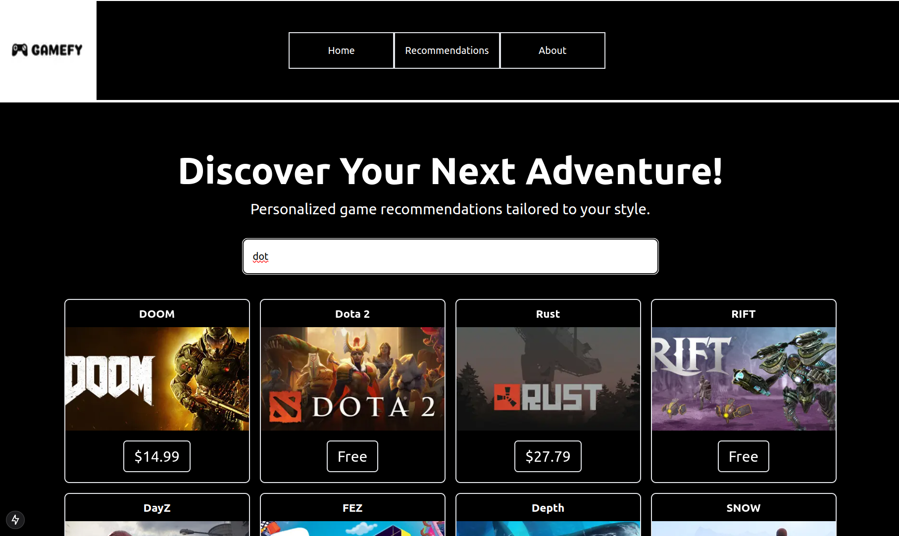
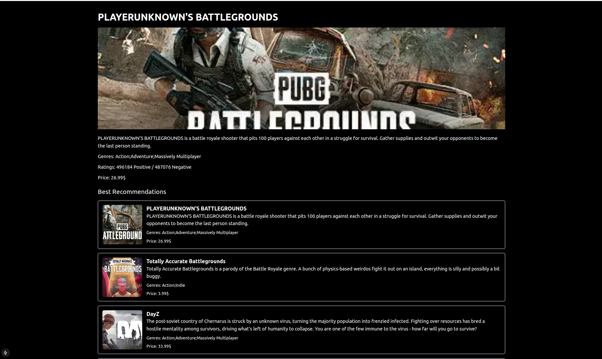

# Game Recommendation System

## Overview
This project is a Full Stack Game Recommendation System that allows users to discover and explore games based on recommendations. It leverages FastAPI for the backend, Next.js for the client-side application, and SQL Server for database management. The recommendations are powered by embeddings generated using the uae-large-v1 model from Hugging Face, ensuring high-quality suggestions based on the cosine distance of game descriptions. I only took 1,000 games from the Steam dataset available on Kaggle because embedding takes too much time, and my compute power is limited. 
## Prerequisites

Ensure you have the following tools installed on your system:

- [Docker](https://www.docker.com/)
- [Docker Compose](https://docs.docker.com/compose/)
- [Node.js](https://nodejs.org/) (v16 or later is recommended)
- [npm](https://www.npmjs.com/)

## Getting Started

Follow these steps to set up and run the project locally:

### 1. Clone the Repository

```bash
git clone https://github.com/your-username/GameRecommendationSystem.git
cd GameRecommendationSystem
```

### 2. Build and Run the Backend with Docker

Use Docker Compose to build and start the backend services:

```bash
sudo docker-compose up --build
```

This will build the Docker images and start the necessary services.

### 3. Set Up the Client

Navigate to the `Client/` directory, install dependencies, and start the development server:

```bash
cd Client/
npm install
npm run dev
```

### 4. Access the Application

- Open your browser and navigate to:
  - Local: [http://localhost:3000](http://localhost:3000)

## Backend API Endpoints

### 1. Get Top-Rated Games
**Endpoint:** `/top-rated`

**Method:** `GET`

**Query Parameters:**
- `limit` (optional, default=20): Number of top-rated games to fetch.

**Response:**
A list of top-rated games.

### 2. Search Games
**Endpoint:** `/search`

**Method:** `GET`

**Query Parameters:**
- `query` (required): The search term for game names.

**Response:**
A list of games matching the search query, sorted by relevance.

### 3. Get Recommendations
**Endpoint:** `/recommand/{id}`

**Method:** `GET`

**Path Parameters:**
- `id` (required): The app ID of the game for which recommendations are needed.

**Response:**
A list of top 10 recommended games based on cosine similarity of embeddings. The embeddings are generated using the `uae-large-v1` model and represent the game descriptions.

### 4. Get Game by ID
**Endpoint:** `/{id}`

**Method:** `GET`

**Path Parameters:**
- `id` (required): The app ID of the game.

**Response:**
Detailed information about the specified game.

## Troubleshooting

### Common Issues That i encountered and some advices that may be useful 

1. **Permission Denied Errors**:
   - If you encounter an `EACCES` error, ensure that you have proper permissions for the `.next` directory:
     if it's not you can just delete the `.next` directory to allow Next.js to rebuild it:
     ```bash
     rm -rf Client/.next
     ```

2. **Dependencies Not Installed**:
   - Ensure you run `npm install` in the `Client/` directory before starting the development server.

3. **Docker Build Issues**:
   - If the Docker build fails, try cleaning up the Docker environment and rebuilding:
     ```bash
     sudo docker-compose down --volumes --remove-orphans
     sudo docker-compose up --build

## App UI Screenshots

Here are two screenshots of the app UI:

### Screenshot 1:


### Screenshot 2:
